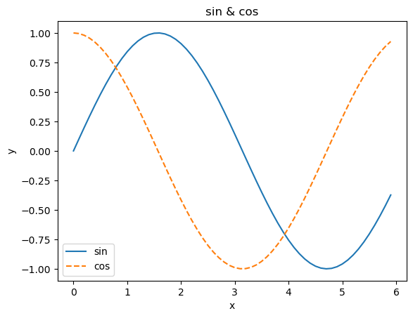
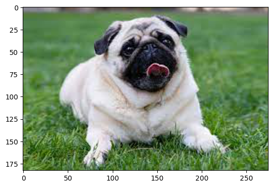

# chapter 1

## pyplot

### 단순한 그래프 그리기


```python
import numpy as np
import matplotlib.pyplot as plt
from matplotlib.image import imread
```


```python
# 데이터 준비
x = np.arange(0, 6, 0.1)
y = np.sin(x)
```


```python
# 그래프 그리기
plt.plot(x, y)
plt.show()
```


    

    


### pyplot의 기능 


```python
# 데이터 준비
x = np.arange(0, 6, 0.1) # 0에서 6까지 0.1 간격으로 생성
y1 = np.sin(x)
y2  = np.cos(x)

# 그래프 그리기
plt.plot(x, y1, label="sin") 
plt.plot (x, y2, linestyle="--", label="cos") # cos 함수는 점선으로 그리기
plt.xlabel("x") # x축 이름
plt.ylabel("y") # y축 이름
plt.title('sin & cos') # 제목
plt.legend()
plt.show()
```


    

    


### 이미지 표시하기


```python
img = imread('dog.jpg')

plt.imshow(img)
plt.show()
```


    

    

